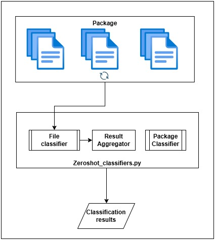

# Zero-Shot Prompting Baseline Package Classifier

### RQ2: General LLM Capabilities  
**Can open-source LLMs detect malicious intent in code and packages as effectively as proprietary LLMs?**

This repository contains experiments for zero-shot prompting baseline package classification using a language model (LLM). The goal is to classify packages without any prior training data, leveraging the inherent capabilities of the LLM.  

The figure below illustrates the process used in these experiments:



---

## Folder Structure

- `call_model.py` – Defines the LLM class responsible for managing the model interactions in this experiment.
- `generate_prompt.py` – Manages the prompt formatting and structure sent to the LLM.
- `main.py` – The main script orchestrating the entire experiment workflow.
- `response_formats.py` – Defines the expected response formats for each LLM model used.
- `zeroshot_classifiers.py` – Contains functions for initializing LLM calls, aggregating file classification results, and invoking the package classifier.

---

## Running the Experiment

Navigate to the experiment directory:
```bash
cd RAG_experiments/zero_shot_prompting_baseline_package_classifier
```

Run the experiment:
```bash
python main.py
```

### Configuration Steps:
1. **Modify Directories** – Update the package and result directories as needed.
2. **Select Model** – Change the model configuration to the intended model (e.g., use `"gpt-4.0"` to specify OpenAI's GPT).
3. **API Key Configuration** – Ensure that the `.env` file contains the necessary API key/token for OpenAI or Hugging Face.
4. **Access for Hugging Face Models** – If using a gated Hugging Face model, ensure you have the necessary access permissions.

Results
The experiment results are stored in:

bash
```
../Results/ZSP_package_classifier
```
Sample Output:
```
{
    "setup.py": {
        "filename": "setup.py",
        "result": {
            "Predicted Classification": "Malicious",
            "Malicious Score": 95,
            "Explanation": "The script appears to be malicious as it attempts to install a browser extension without user consent, modify Chrome shortcuts to load the extension, and access the clipboard, which could lead to potential security risks such as data theft or unauthorized access. The script also uses obfuscated JavaScript code, which is a common tactic used by malware authors to evade detection."
        }
    },
    "PKG-INFO": {
        "filename": "PKG-INFO",
        "result": {
            "Predicted Classification": "Benign",
            "Malicious Score": 0,
            "Explanation": "The provided PKG-INFO file content appears to be a standard metadata file for a Python package, with all fields filled with 'UNKNOWN' which suggests a lack of information rather than malicious intent. The absence of any suspicious or executable code, combined with the typical structure of a package metadata file, leads to the conclusion that this file is benign."
        }
    },
    "__init__.py": {
        "filename": "__init__.py",
        "result": {
            "Predicted Classification": "Benign",
            "Malicious Score": 0,
            "Explanation": "Based on the given information, the file content is empty, and the filename __init__.py is a common file in Python packages, indicating it's likely a benign file. Without any malicious code or questionable content present, there's no reason to believe this file poses a security threat."
        }
    },
    "overall_prediction": "Malicious",
    "overall_malicious_score": 95,
    "overall_explanation": "The overall package is classified as malicious due to the presence of a highly malicious file (setup.py) with a score of 95, which attempts to install a browser extension without user consent and accesses the clipboard, posing potential security risks. Although other files in the package, such as PKG-INFO and __init__.py, are benign, the malicious intent and high score of the setup.py file outweigh their benign nature, leading to an overall malicious classification."
}
```
